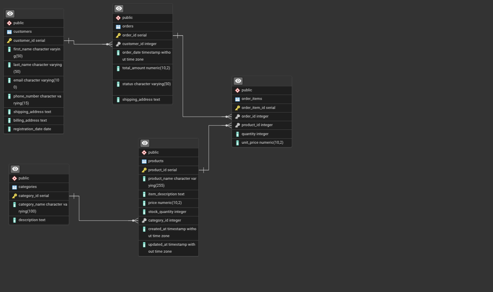

# ecommerce_database_management

This is my first SQL project, a base layout for an e-commerce database. 
The aim of this is to showcase my skill in SQL, specifically **Postgresql**

## Database and Tools

- Postgresql
- pgAdmin4

## Task

The task here is to create a database schema for an online store, focusing on product management and order tracking.

### Key Features to Implement:

- Tables for Product Categories
- Customers
- Orders
- OrderItems
- 

### Analysis Queries Showcased

- Relationships between products and categories
- customers and orders
- Orders
- Order items

## Things learned and Implemented

- I learned a lot of new syntax
- I learned about the use of constraints
- I learned or constraint violations and how to resolve them
- I learned the importance of the **CHECK**
- Finally, the importance of proper structure planning before creating tables

## Important notes

- The **2_data_seeding.sql** is just a dummy dataset and it isn't a real 
- Scripts are numbered in the order you should run them
- Feel free to contribute, I'm looking forward to your PRs
